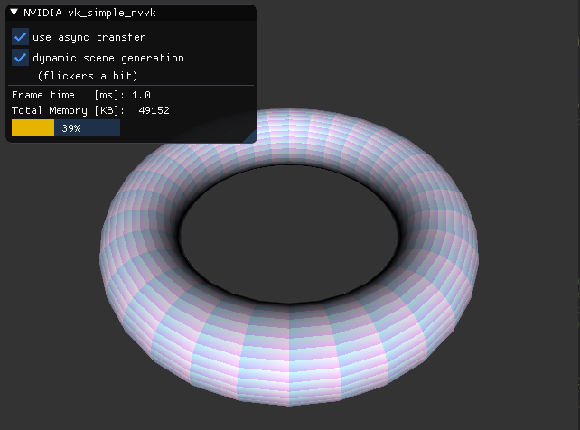

# vk_async_resources



## About

This sample showcases several framework helper classes to aid
development with Vulkan using its C api.

- Resource and Memory Management
- DescriptorSet Utilities
- Asynchronous Staging Transfers
- Runtime GLSL Shaders to SPIR-V
- Interaction with Swapchains

## Resource And Staging Operations

This sample in particular demonstrates asynchronous resource creation
and transfers by creating a torus with different subdivision every couple
frames.

> WARNING: The torus will flicker if recreation is active,
> this is intentional

You should see that if the asynchronous path is activated (default)
the average frame time shown in the UI is faster.

Compared to OpenGL you have more responsibilities in Vulkan.
For example you cannot just `glDelete` but have to ensure the objects
are not currently used by the device. Look for `unusedResources` array
usage.

Furthermore when you did trigger uploads in OpenGL by `glBufferSubData` or
`glBufferStorage` the driver managed the upload for you through the use of
**staging buffers**. In Vulkan these buffers would be allocated
with the following memory properties that depend on the direction of the
transfer:

``` cpp
VK_MEMORY_PROPERTY_HOST_VISIBLE_BIT |
(toDevice ? VK_MEMORY_PROPERTY_HOST_COHERENT_BIT : VK_MEMORY_PROPERTY_HOST_CACHED_BIT)
```

In Vulkan you want to avoid interfering with the graphics workload and make use
of dedicated transfer queues. You should copy the data into a temporary staging
memory and then copy from this staging resource into the finale resource using
the transfer queue. Look for code related to the `useAsync` path that makes use
of `nvvk::StagingMemoryManager`.

While it may be simpler and more convenient to synchronize the device with the
host and avoid deferring operations, this simple approach can create stuttering
and wastes performance.

Depending on the usage-scenario such synchronization may be totally fine
(window resizing, major scene loading operations, no continous redraw etc.),
but in general you should design for leveraging the asynchronous capabilities
of Vulkan.


> The following graphs don't represent time accurately, but are for illustration
> purposes only.

### Blocking / Synchronous Transfer

The naive approach is to wait for the device, do the upload, release temporary 
resources and then prepare the next frame and submit it. This means a lot of idle time
both on the device and the host. The benefit is that due to the blocking
synchronization you can easily delete resources directly as the device
is not using them in-flight.

If there are major changes in your application that cause 
low responsiveness anyway, this could be acceptable, but otherwise would 
severely impact interactivity and suffer from non-optimal total transfer
times.

> Note: Several of our samples do this for the sake of simplicity and reducing
> the complexity of the samples. But most of them also only have to load
> resources once and are rather static afterwards.

~~~
        -------------------------------------------------------------------------->
Graphics: ...  Render Frame |      transfer           |  IDLE :(
        -------------------------------------------------------------------------->
Host    : | wait | IDLE :(  | submit & wait | IDLE :( | release ... prep Frame + 1
~~~

### Single Queue Transfer

For devices that support only one combined graphics and transfer queue 
you would schedule the transfer into the main queue prior the rendering
operations for the next frame.

All `vkQueueSubmit` operations on the same queue are processed in order.

This time we need to use a `VkFence` to know when it's safe to
release the resources used for staging Operations. 

We would not wait for the fence but rather check for completion (which is what
we do in this sample)

Alternatively we setup our render system that we guarantee that 
the host never is more than N frames ahead of the device and then
simply release resources from N frames ago.

The downside of this approach is that we now impact the overall frame time
depending on how much transfer work needs to be done. This can
result in stuttering if there is a lot of data.
The benefit is that your updates are done in pipeline with the rest of the
frame, so the update process is safe and won't interfere with data being
used.

~~~
F: staging fence -> signals ability to release staging resources

        ---------------------------------------------------------------------->
Graphics:   Render Frame     | transfer | signal F | Render Frame + 1 ...
        ---------------------------------------------------------------------->
Host    : | submit |  ... prep Frame + 1 ...          | check F | try release |
~~~

### Asynchronous Queue Transfer

Here we can overlap the transfer to the device in a non-blocking way.
Both rendering and transfer operations can continue. A lot of 
devices support this kind workflow.

Compared to the previous approach we need to use a `VkSemaphore` to ensure
that our graphics work doesn't start until the transfer has completed.

It is not that much more complex compared to the previous approach but
maximizes the utilization of the various device engines.

However, there is one caveat, the target buffers must not be in-flight while
the async transfer is done. That means for initial buffer uploads the async
queue is ideal, if you want to update existing content, you either have to
double-buffer (alternating the buffers used every other frame to avoid
the in-flight scenario), or use the above single queue mechanism.
If "updates" are a bit more rare and not as data heavy, the two approaches
should complement each other.

~~~
F: staging fence     -> signals ability to release staging resources
S: staging semaphore -> signals that transfer completed

        ---------------------------------------------------------------------->
Graphics: ...  Render Frame                 | wait S | Render Frame + 1 ...
        ---------------------------------------------------------------------->
Transfer:          | transfer | signal F, S | 
        ---------------------------------------------------------------------->
Host    : | submit |  ... prep Frame + 1 ...     | check F | try release | ..
~~~

## Highlights

- `Sample` : implements the sample. The sample itself is designed to run without 
  a window. It is created from an existing `nvvk::Context` and also makes use of 
  the sample specific `FrameBuffer` utility class.
- `Sample::init` : here you will find the setup of generic utility classes that
  would be typical for Vulkan samples.
- `Sample::initTest` : initializes the resources for rendering the torus scene.
- `Sample::initTestGeometry` : sets up the vertex/index buffers for the torus and
  also showcases the staging transfers.
- `SampleWindow` : derives from `NVPWindow` and creates a `VkSurfaceKHR` for it
  that is used with the `nvvk::SwapChain`. It also handles the events for the sample.
- `main` : Sets up `nvvk::Context` and implements the principle hot loop.

## Building
Make sure to have installed a recent [Vulkan-SDK](http://lunarg.com/vulkan-sdk/). 
Always use 64-bit build configurations.

Ideally, clone this and other interesting [nvpro-samples](https://github.com/nvpro-samples) repositories into a common subdirectory. You will always need [nvpro_core](https://github.com/nvpro-samples/nvpro_core). The nvpro_core is searched either as a subdirectory of the sample, or one directory up.